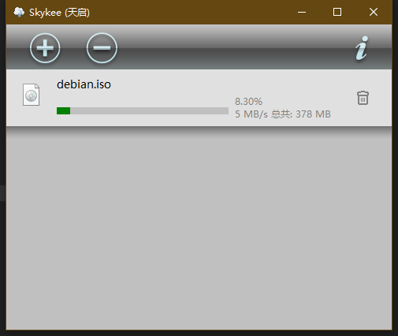

# Skykee

Skykee, a downloader, completed in March 2013.

Skykee, 一个下载程序, 完成于 2013 年 3 月 (大概初三).

因为在网络上找到了一个开源的下载模块的代码, 于是兴高采烈地借题发挥写了一个下载程序.

这个东西的特点是支持多语言, 它界面的文字可以按照系统语言的设置自动在简体中文, 繁体中文, 日语和英语之间切换.

简繁中文和英语还比较好理解, 基本靠谷歌翻译和自己就能大概搞定, 但日语是从哪来的? 是因为当时有个好基友在学日语, 于是让他翻译了一下.

现在以我的三脚猫日语水平看了一下当时的翻译, 似乎没什么太大的问题 (毕竟界面上都是些短语也没什么复杂的玩意). 好基友还挺靠谱.

## Copyright and License

Copyright (C) 2010-2013 MaxXSoft (MaxXing). License GPLv3.
